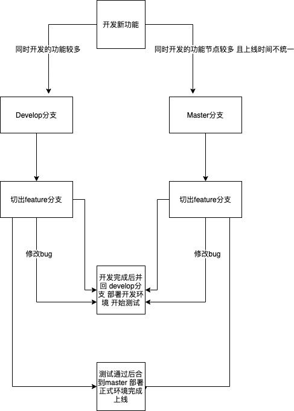

# Git使用规范及分支管理

## 常用Git命令
+ 查看版本: git --version

+ 查看git配置: git config --list  
```
alias.st = status  // 就是配置了bieming
alias.cm = commit -m 
```
    + 配置全局 email 和 name
    ```sh
    git config --global user.name 'chuhx'
    git config --global user.email '123@126.com'
    ```
    + 设置当前仓库 email 和 name
    ```sh
    git config user.name 'xiaoming'
    # --loacl 可以省略
    git config --local user.email 'vip@126.com'
    ```
+ 查看分支：git branch

+ 创建分支：git branch <name>

+ 切换分支：git checkout <name>

+ 创建+切换分支：git checkout -b <name>

+ 合并某分支到当前分支：git merge <name>  

+ 抓取(跟新本地的 远端分支): git fetch origin dev

+ 撤销提交: git reset --hard 10bb4

+ 删除分支：git branch -d <name> 注意:删除当前分支 需要切换到其他分支   如果要删除的分支没有和当前的分支合并 会提示的 删除失败  真要删除 用 -D

## 分支管理

+ gitHub https://github.com/orgs/starcloud-ai
+ gitLab http://git.in-clustar.ai/
## 主要分支

### master 
+ master是线上稳定的代码分支，一般不能直接在上面修改 一直存在 对应我们的线上环境

### develop 
+ 常规开发分支, 一直存在 对应我们开发环境

## 辅助分支

### feature
+ 功能开发分支, 从 master 分支而来, 然后合并入develop, 进行测试.
+ 测试过程中修改bug直到功能上线 都在此分支进行 
+ 上线时将此分支 合并到 master
### hotfix
+ 修改线上bug 要从 master 分支checkout出 bug分支名称与jira 条目保持一致 如 [OPS-6666] bug验证通过后删除

## 如何使用各种分支

### 开发新功能 - feature
+ 一般情况 同时开发的功能节点较少
    - 从develop 分支 分出 自己的 feature分支 名称与jira 条目保持一致 如 [OPS-9999]
    - 开发完毕后合并回 develop分支 部署开发环境 开始测试
    - 测试通过后 将develop分支合并到 master 部署正式环境
+ 其他情况 同时开发的功能较多 且 上线时间不统一
    - 从 master 分支 分出 自己的 feature分支 名称与jira 条目保持一致 如 [OPS-9999]
    - 开发完毕后合并回 develop分支 部署开发环境 开始测试
    - 测试通过后 将feature分支(此时为OPS-9999)合并到 master 部署正式环境


```
使用 New Merge Requests 方式 通知协同开发人员 review LGTM 后 合并代码 部署开发环境
```

### 修改线上 bug
+ 一般线上出现的 bug 在 develop 也会存在 可以从 master 分支 切出来 bug分支 名称和与jira条目保持一致 如 [OPS-6666] 修改 后 在 develop 环境验证通过后 把此分支合并到master 完成 线上 bug 的修复


## 关于提交
+ 提交时添加本次 commit 的 type
```
git commit -m 'feat: Add carsList formater'
```
+ Type的类型说明
    - init: 项目初始化
    - feat: 添加新特性
    - fix: 修复bug
    - docs: 仅仅修改了文档
    - opt: 优化和改善 比如弹窗进行确认提示等相关的 不会改动逻辑和具体功能等
    - style: 仅仅修改了空格 格式缩进 逗号等等 不改变代码逻辑
    - refactor: 代码重构 没有添加新的功能和修复bug
    - perf: 增加代码进行性能测试
    - test: 增加测试用例
    - chore: 改变构建流程 或者增加依赖库 工具等
    - sava: 单纯的保存记录
    - other: 用于难以分类的类别（不建议使用，但一些如删除不必要的文件，更新.ignore之类的可以使用）


## 建议使用规范

+ 分支上开发的commit建议合并为一个commit, 这样易读, 方便主分支管理.
+ 辅助分支及时删除
+ 冲突提交
    + 修改完冲突, 我们会进行commit提交冲突修改. 不要使用git commit -m, 请直接使用git commit, git会识别你这是一个冲突提交.


## 参考
+ [Git 工作流程](http://www.ruanyifeng.com/blog/2015/12/git-workflow.html)
+ [Git 使用规范流程](http://www.ruanyifeng.com/blog/2015/08/git-use-process.html)
+ [如何写好git commit message](https://www.cnblogs.com/deng-cc/p/6322122.html)


    